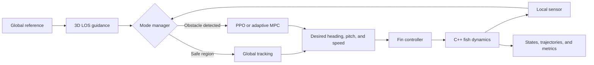

https://github.com/user-attachments/assets/8905b3e3-4f08-4281-bb09-d31432a1d9c3

# RL-UUV Trajectory Planning

A 3D trajectory-tracking and dynamic-obstacle-avoidance simulation for a bio-inspired unmanned underwater vehicle (UUV). The system uses a full fish-body dynamics model, follows a global reference trajectory with 3D line-of-sight (LOS) guidance in obstacle-free regions, and switches to either a PPO reinforcement-learning policy or an adaptive model predictive controller (MPC) when an obstacle is detected. A fin controller converts the resulting commands into executable control inputs.

> This document describes the `adaptive-mpc` branch.

## Features

- A 3D UUV/bio-inspired fish dynamics model with its core update step accelerated through C++ and pybind11.
- 3D LOS global trajectory tracking with hysteresis for entering and leaving local obstacle-avoidance mode.
- A local obstacle-avoidance policy based on Stable-Baselines3 PPO.
- A CasADi-based adaptive MPC local planner that accounts for the velocity, acceleration, size, and collision risk of dynamic obstacles.
- A local sensor model combining a field of view with ray detection.
- Scenarios with static spherical obstacles and 3D dynamic obstacles.
- Standalone PPO and MPC simulations plus direct comparisons, with trajectory plots, tracking errors, planning times, and animations.
- Randomized start and goal positions, obstacles, ocean currents, and observation noise during PPO training.

## System Architecture



By default, the hybrid simulation switches from `GLOBAL_TRACKING` to `LOCAL_AVOIDANCE` when an obstacle enters the activation threshold and returns to LOS tracking after the vehicle leaves the hazardous region. RL and MPC are interchangeable local-planning methods: each can run independently, or both can be compared in the same scenario.

## Repository Structure

```text
RL-UUV-trajectory-planning/
├── dynamics/                    # Fish dynamics, state indices, parameters, and C++ extension
├── rl_training/
│   ├── callbacks/               # Collision-aware policy evaluation callback
│   ├── config/                  # PPO and environment configuration
│   ├── envs/                    # Gymnasium 3D avoidance environment and reward function
│   ├── train_local_avoid.py     # PPO training entry point
│   ├── evaluate_policy.py       # Policy evaluation entry point
│   └── test_fish_env.py         # Environment interface check
├── simulation/
│   ├── fin_controller/          # Converts heading, pitch, and speed into fin commands
│   ├── global_planner/          # LOS and Bézier-PSO global-planning modules
│   ├── local_planner/
│   │   ├── rl_planner/          # PPO inference wrapper
│   │   └── mpc_planner/         # Adaptive MPC local planner
│   └── main/                    # Hybrid simulation, comparison experiments, and visualization
└── demo.mp4                     # Project demo video
```

Training models and logs are written to `artifacts/` by default, while simulation animations are written to `data_saving/`. Both directories are excluded by `.gitignore`.

## Requirements

- Python 3.10 or later; the project has been checked with Python 3.11.
- A toolchain capable of compiling C++:
  - Windows: Visual Studio Build Tools with **Desktop development with C++**.
  - Ubuntu/Debian: `build-essential` and the development headers for the installed Python version.
- Optional: FFmpeg for MP4 export. If FFmpeg is unavailable, animations can still be exported as GIFs with Pillow.

Installing the dependencies in a virtual environment is recommended:

```powershell
git clone https://github.com/kkisok0123/RL-UUV-trajectory-planning.git
Set-Location RL-UUV-trajectory-planning
git switch adaptive-mpc

python -m venv .venv
.\.venv\Scripts\Activate.ps1
python -m pip install --upgrade pip setuptools wheel
python -m pip install numpy matplotlib gymnasium stable-baselines3 casadi pybind11 pillow tensorboard
```

On Linux or macOS, replace the activation command with:

```bash
source .venv/bin/activate
```

## Build the Dynamics Extension

Enter the `dynamics` directory and build the pybind11 extension in place:

```powershell
Set-Location dynamics
python setup_fish_dynamics.py build_ext --inplace
Set-Location ..
```

Verify that the extension loads correctly:

```powershell
python -c "from dynamics import backend_name; print(backend_name())"
```

The expected output is:

```text
pybind11
```

## Quick Start

After cloning the repository, create the default animation-output directory:

```powershell
New-Item -ItemType Directory -Force data_saving | Out-Null
```

### 1. Run the MPC Simulation Without a Pretrained Model

```powershell
python -c "from simulation.main import run_hybrid_los_mpc_simulation as run; run(visualize=True, animation_path='data_saving/hybrid_los_mpc.gif', animation_fps=30)"
```

### 2. Train the PPO Local-Avoidance Policy

The default configuration trains four parallel environments for 1,500,000 timesteps. When `tensorboard` is installed, the training script starts a monitoring page at `http://127.0.0.1:6006`.

```powershell
python -c "import simulation; from rl_training.train_local_avoid import main; main()"
```

Training outputs:

```text
artifacts/
├── logs/                        # TensorBoard and evaluation logs
└── models/
    ├── best_model.zip           # Best model observed during evaluation
    └── latest_model.zip         # Model saved at the end of training
```

### 3. Evaluate the Trained Policy

By default, the evaluation script loads `artifacts/models/latest_model.zip` and reports mean return, success rate, collision rate, and unsafe-termination rate:

```powershell
python -c "import simulation; from rl_training.evaluate_policy import main; main(episodes=5)"
```

### 4. Run the RL Hybrid Simulation

After training, or after placing a compatible model in `artifacts/models/`, run:

```powershell
python -m simulation.main
```

The default entry point generates:

```text
data_saving/hybrid_los_rl.gif
```

You can also call the RL simulation explicitly:

```powershell
python -c "from simulation.main import run_hybrid_los_rl_simulation as run; run(visualize=True, animation_path='data_saving/hybrid_los_rl.gif', animation_fps=30)"
```

### 5. Compare PPO and MPC

```powershell
python -c "from simulation.main import run_hybrid_los_comparison_simulation as run; run(visualize=True, animation_path='data_saving/hybrid_los_compare.gif', animation_fps=30)"
```

The comparison runs both local planners against the same reference trajectory and obstacle scenario. It reports whether the vehicle reached the goal or collided, along with local decision time and attitude-tracking error.

## Reinforcement-Learning Environment

`FishAvoidEnv` follows the Gymnasium API:

- **Observation space:** A 23-dimensional continuous vector containing body-frame linear and angular velocities; relative goal position and distance; the nearest visible obstacle's relative position, velocity, clearance, and radius; and a 5-dimensional history of fin states.
- **Action space:** A 3-dimensional normalized continuous action mapped to the desired body-frame velocity, then converted into heading, pitch, and speed references before being applied to the dynamics through the fin controller.
- **Domain randomization:** Start position, goal position, obstacle count and size, dynamic-obstacle velocity, ocean current, and observation noise.
- **Reward terms:** Goal progress, success bonus, collision and unsafe-clearance penalties, direction error, angular velocity, action smoothness, energy use, and elapsed time.
- **Termination conditions:** Goal reached, collision, unsafe clearance, or maximum episode length.

Run the environment interface check with:

```powershell
python -c "import simulation; from rl_training.test_fish_env import main; main()"
```

## Key Configuration Files

| File | Main settings |
| --- | --- |
| `rl_training/config/fish_env_config.py` | Timestep, sensor, domain randomization, ocean current, observation noise, termination conditions, and reward weights |
| `rl_training/config/ppo_config.py` | PPO learning rate, rollout length, batch size, discount factor, total timesteps, and evaluation frequency |
| `simulation/local_planner/mpc_planner/config.py` | Prediction horizon, obstacle count, cost weights, collision clearance, and adaptive risk parameters |
| `simulation/fin_controller/config.py` | Fin-controller parameters and actuator constraints |
| `simulation/main/hybrid_simulation.py` | Default trajectory, obstacle scenario, mode-switching thresholds, and main simulation loop |

Prefer editing the new dictionaries returned by the configuration builder functions instead of maintaining duplicate parameter sets across modules.

## Python API Example

```python
from simulation.main import HybridSimulationConfig, run_hybrid_los_mpc_simulation

# Use fewer simulation steps for a quick installation and dynamics check.
config = HybridSimulationConfig(max_steps=50)
result = run_hybrid_los_mpc_simulation(
    visualize=False,
    sim_config=config,
)

print("reached_goal:", result["reached_goal"])
print("collided:", result["collided"])
print("planner timing:", result["local_planner_timing"])
print("tracking metrics:", result["tracking_metrics"])
```

## Troubleshooting

### RL Model Not Found

If you see `RL model not found`, train the PPO policy first or place a compatible model at either of these paths:

```text
artifacts/models/latest_model.zip
artifacts/models/best_model.zip
```

The model must use the 23-dimensional observation space. Older 2D models or models trained with a different observation definition cannot be loaded directly.

### Circular Import When Starting from `rl_training`

On the current branch, `simulation/__init__.py` imports simulation entry points eagerly. Running `python -m rl_training...` directly may therefore trigger a circular import. The training, evaluation, and environment-check commands in this README import `simulation` first to work around the current import order. A future improvement would replace the top-level exports with lazy imports.

### Low GPU Utilization Warning from PPO

The current policy is an MLP, and Stable-Baselines3 PPO is generally more efficient on the CPU for this architecture. The warning does not prevent training. To force CPU execution, pass `device="cpu"` when constructing or loading the model.

### Animation Cannot Be Saved

- GIF export requires `pillow`.
- MP4 export requires FFmpeg to be installed and available as `ffmpeg` on the command line.
- Animation files can be large; reduce `animation_fps` or `max_steps` if needed.

## License

This repository currently does not include a license file. Add an explicit open-source license and citation information before encouraging reuse or accepting external contributions.
