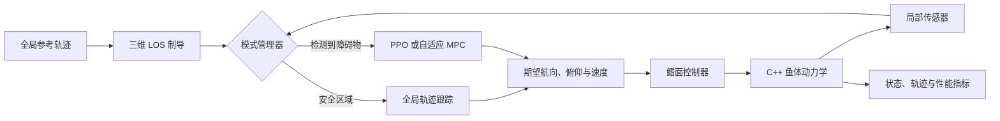

https://github.com/user-attachments/assets/8905b3e3-4f08-4281-bb09-d31432a1d9c3

# RL-UUV Trajectory Planning

面向仿生无人水下航行器（UUV）的三维轨迹跟踪与动态避障仿真项目。系统以完整鱼体动力学为被控对象，在无障碍区域使用三维视线制导（LOS）跟踪全局参考轨迹，并在检测到障碍物后切换至 PPO 强化学习或自适应 MPC 局部规划器，最终通过鳍面控制器生成可执行控制量。

> 本文档对应 `adaptive-mpc` 分支。


## 主要功能

- 三维 UUV/仿生鱼动力学模型，核心更新步骤通过 C++ 与 pybind11 加速。
- 三维 LOS 全局轨迹跟踪，并带有进入/退出局部避障的迟滞切换机制。
- 基于 Stable-Baselines3 PPO 的局部避障策略。
- 基于 CasADi 的自适应 MPC 局部规划器，考虑动态障碍物的速度、加速度、尺寸与碰撞风险。
- 视场角和射线检测组成的局部传感器模型。
- 静态球形障碍物与三维动态障碍物场景。
- PPO、MPC 单独仿真及二者对比，支持轨迹、控制误差、规划耗时和动画输出。
- 训练阶段包含起终点、障碍物、海流和观测噪声的随机化。

## 系统架构



默认混合仿真在障碍物距离小于进入阈值时由 `GLOBAL_TRACKING` 切换为 `LOCAL_AVOIDANCE`，在脱离危险区域后恢复 LOS 跟踪。RL 与 MPC 是两种可替换的局部规划方案，可分别运行或进行同场景对比。

## 项目结构

```text
RL-UUV-trajectory-planning/
├── dynamics/                    # 鱼体动力学、状态索引、参数及 C++ 扩展
├── rl_training/
│   ├── callbacks/               # 碰撞感知的策略评估回调
│   ├── config/                  # PPO 与环境配置
│   ├── envs/                    # Gymnasium 三维避障环境和奖励函数
│   ├── train_local_avoid.py     # PPO 训练入口
│   ├── evaluate_policy.py       # 策略评估入口
│   └── test_fish_env.py         # 环境接口检查
├── simulation/
│   ├── fin_controller/          # 航向、俯仰和速度到鳍面指令的控制器
│   ├── global_planner/          # LOS 与 Bézier-PSO 全局规划模块
│   ├── local_planner/
│   │   ├── rl_planner/          # PPO 推理封装
│   │   └── mpc_planner/         # 自适应 MPC 局部规划器
│   └── main/                    # 混合仿真、对比实验和可视化
└── demo.mp4                     # 项目演示视频
```

训练产生的模型和日志默认写入 `artifacts/`，仿真动画默认写入 `data_saving/`。这两个目录已被 `.gitignore` 忽略。

## 环境要求

- Python 3.10 或更高版本（本项目已在 Python 3.11 下检查）
- 支持 C++ 编译的工具链
  - Windows：Visual Studio Build Tools（Desktop development with C++）
  - Ubuntu/Debian：`build-essential` 与对应版本的 Python 开发头文件
- 可选：FFmpeg，用于导出 MP4；未安装时仍可通过 Pillow 导出 GIF

建议在虚拟环境中安装依赖：

```powershell
git clone https://github.com/kkisok0123/RL-UUV-trajectory-planning.git
Set-Location RL-UUV-trajectory-planning
git switch adaptive-mpc

python -m venv .venv
.\.venv\Scripts\Activate.ps1
python -m pip install --upgrade pip setuptools wheel
python -m pip install numpy matplotlib gymnasium stable-baselines3 casadi pybind11 pillow tensorboard
```

Linux/macOS 只需将虚拟环境激活命令替换为：

```bash
source .venv/bin/activate
```

## 编译动力学扩展

进入 `dynamics` 目录并原地编译 pybind11 扩展：

```powershell
Set-Location dynamics
python setup_fish_dynamics.py build_ext --inplace
Set-Location ..
```

检查扩展是否加载成功：

```powershell
python -c "from dynamics import backend_name; print(backend_name())"
```

正常情况下应输出：

```text
pybind11
```

## 快速开始

首次克隆后先创建用于保存动画的目录：

```powershell
New-Item -ItemType Directory -Force data_saving | Out-Null
```

### 1. 运行不依赖预训练模型的 MPC 仿真

```powershell
python -c "from simulation.main import run_hybrid_los_mpc_simulation as run; run(visualize=True, animation_path='data_saving/hybrid_los_mpc.gif', animation_fps=30)"
```

### 2. 训练 PPO 局部避障策略

默认配置使用 4 个环境训练 1,500,000 个时间步。安装 `tensorboard` 后，训练脚本会在 `http://127.0.0.1:6006` 启动监控页面。

```powershell
python -c "import simulation; from rl_training.train_local_avoid import main; main()"
```

训练结果：

```text
artifacts/
├── logs/                        # TensorBoard 与评估日志
└── models/
    ├── best_model.zip           # 评估期间表现最好的模型
    └── latest_model.zip         # 训练结束时保存的模型
```

### 3. 评估训练策略

评估脚本默认读取 `artifacts/models/latest_model.zip`，并输出平均回报、成功率、碰撞率和不安全终止率：

```powershell
python -c "import simulation; from rl_training.evaluate_policy import main; main(episodes=5)"
```

### 4. 运行 RL 混合仿真

完成训练或将兼容的模型放入 `artifacts/models/` 后运行：

```powershell
python -m simulation.main
```

默认入口会生成：

```text
data_saving/hybrid_los_rl.gif
```

也可以显式调用 RL 仿真接口：

```powershell
python -c "from simulation.main import run_hybrid_los_rl_simulation as run; run(visualize=True, animation_path='data_saving/hybrid_los_rl.gif', animation_fps=30)"
```

### 5. 对比 PPO 与 MPC

```powershell
python -c "from simulation.main import run_hybrid_los_comparison_simulation as run; run(visualize=True, animation_path='data_saving/hybrid_los_compare.gif', animation_fps=30)"
```

对比仿真会在相同参考轨迹与障碍物场景中分别运行两种局部规划器，并报告是否到达目标、是否碰撞、局部决策耗时与姿态跟踪误差。

## 强化学习环境

`FishAvoidEnv` 遵循 Gymnasium API：

- 观测空间：23 维连续向量，包括本体系线速度与角速度、相对目标位置和距离、最近可见障碍物的相对位置/速度/间隙/半径，以及 5 维鳍面历史状态。
- 动作空间：3 维归一化连续动作，映射为本体系期望速度，再经航向、俯仰、速度参考与鳍面控制器作用于动力学模型。
- 场景随机化：起点、目标、障碍物数量与尺寸、动态障碍物速度、环境海流和观测噪声。
- 奖励项：目标进度、到达奖励、碰撞和危险距离惩罚、方向偏差、角速度、动作平滑性、能耗与时间惩罚。
- 终止条件：到达目标、发生碰撞、进入不安全间隙或达到最大步数。

环境接口检查：

```powershell
python -c "import simulation; from rl_training.test_fish_env import main; main()"
```

## 关键配置

| 配置文件 | 主要内容 |
| --- | --- |
| `rl_training/config/fish_env_config.py` | 时间步、传感器、场景随机化、海流、观测噪声、终止条件和奖励权重 |
| `rl_training/config/ppo_config.py` | PPO 学习率、采样步数、批大小、折扣因子、训练总步数和评估频率 |
| `simulation/local_planner/mpc_planner/config.py` | 预测步长、障碍物数量、代价权重、碰撞间隙和自适应风险参数 |
| `simulation/fin_controller/config.py` | 鳍面控制器参数及执行器约束 |
| `simulation/main/hybrid_simulation.py` | 默认轨迹、障碍物场景、模式切换阈值和仿真主循环 |

建议修改配置构建函数返回的新字典，不要在多个模块中重复维护同一组参数。

## Python 接口示例

```python
from simulation.main import HybridSimulationConfig, run_hybrid_los_mpc_simulation

# 缩短仿真步数，适合快速检查安装和动力学扩展。
config = HybridSimulationConfig(max_steps=50)
result = run_hybrid_los_mpc_simulation(
    visualize=False,
    sim_config=config,
)

print("reached_goal:", result["reached_goal"])
print("collided:", result["collided"])
print("planner timing:", result["local_planner_timing"])
print("tracking metrics:", result["tracking_metrics"])
```

## 常见问题

### 找不到 RL 模型

如果出现 `RL model not found`，请先训练 PPO，或将模型放到以下任一路径：

```text
artifacts/models/latest_model.zip
artifacts/models/best_model.zip
```

模型的观测空间必须为 23 维；旧版二维或不同观测定义的模型不能直接加载。

### 从 `rl_training` 直接启动时报循环导入错误

当前分支的 `simulation/__init__.py` 会提前导入仿真入口，因此直接运行 `python -m rl_training...` 可能触发循环导入。本文训练、评估和环境检查命令先执行 `import simulation`，可绕开当前导入顺序问题。后续可将顶层导出改为延迟导入，从根本上消除该问题。

### PPO 提示在 GPU 上利用率较低

当前策略为 MLP，Stable-Baselines3 的 PPO 通常在 CPU 上更合适。该警告不会阻止运行；如需固定使用 CPU，可在构造或加载模型时指定 `device="cpu"`。

### 动画无法保存

- GIF 需要 `pillow`。
- MP4 需要系统已安装 FFmpeg，并能在命令行中找到 `ffmpeg`。
- 动画文件可能较大，建议降低 `animation_fps` 或减少 `max_steps`。

## 说明

本仓库当前未包含许可证文件。若计划公开发布、复用或接受外部贡献，建议补充明确的开源许可证以及相应的引用信息。
